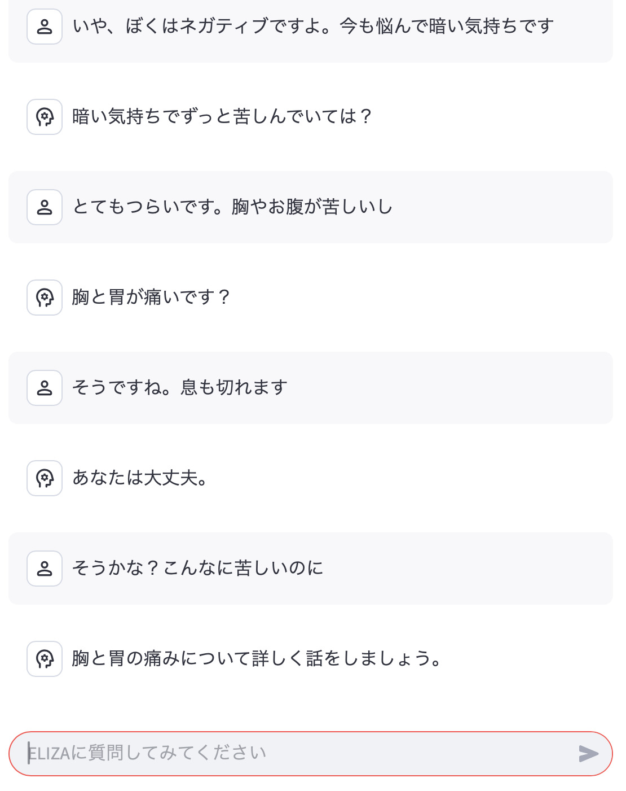

# ELIZAボット

## 使用したもの
 - Streamlit
 - LangChain
 - https://github.com/wadetb/eliza

## インストール
```
git clone https://github.com/akokubo/chat-eliza.git
cd chat-eliza
python3 -m venv venv
source venv/bin/activate
python3 -m pip install --upgrade pip
python3 -m pip install -r requirements.txt
git clone https://github.com/wadetb/eliza
```

## 実行
```
python3 -m streamlit run app.py
```

※英語でのやりとりになります



## 作者
[小久保 温(こくぼ・あつし)](https://akokubo.github.io/)

## ライセンス
[MIT License](LICENSE)
